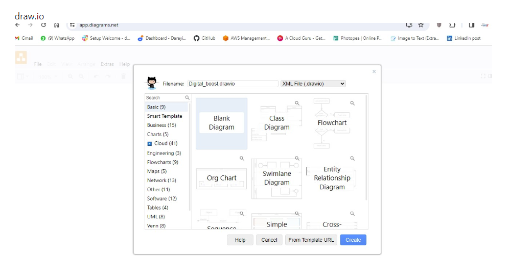
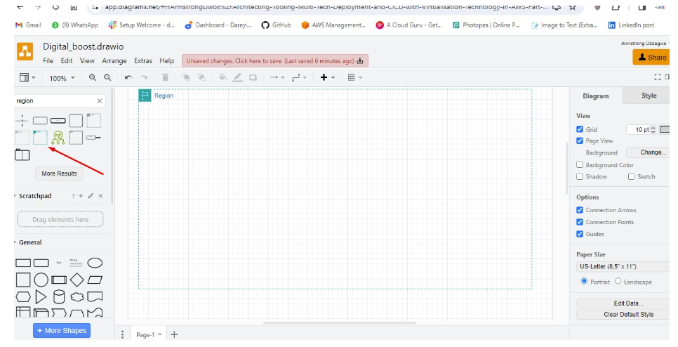
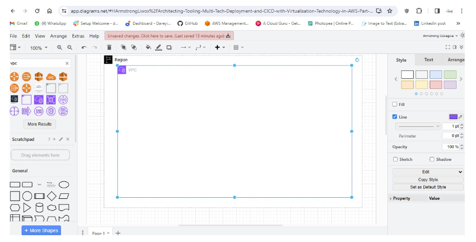
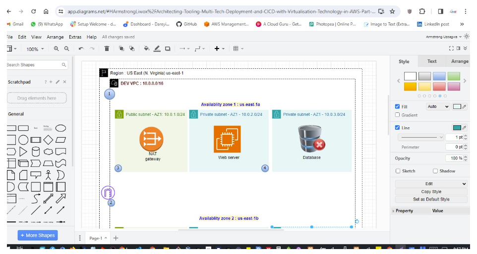
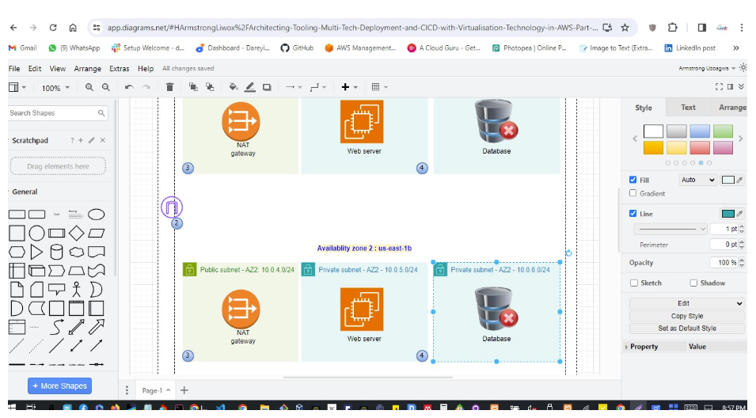
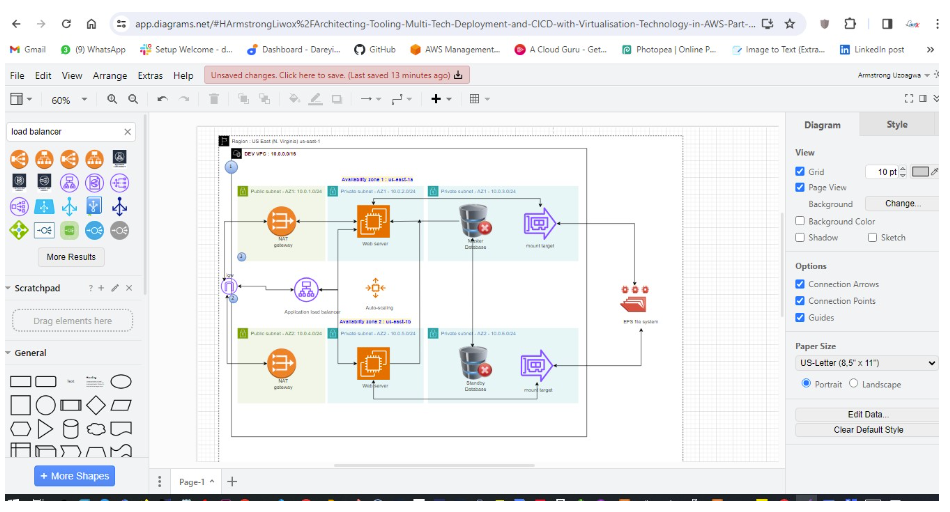

# Architecting-Tooling-Multi-Tech-Deployment-and-CICD-with-Virtualisation-Technology-in-AWS

The Architecture determines what will be built.

## Scenario

A small to medium-sized digital marketing agency, <b><i>DigitalBoost </b></i>, wants to enhance its online presence by creating a high-performance WordPress-based website for their clients. The agency needs a scalable, secure, and cost-effective solution that can handle increasing traffic and seamlessly integrate with their existing infrastructure. Your task as an AWS Solutions Architect is to design and implement a WordPress solution using various AWS services, such as Networking, Compute, Object Storage, and Databases.

## Project Requirement

    - High-performance: Highly available
    - Scalable : infrastructure can easier scale
    - Secure:
    - Cost-effective: something their budget can accomodate

## Some Considerations

    - Proximity to DigitalBoost clients
    - Available services in the chosing region. Reduce Latency as much as possible (CLOUD-FRONT)
    - Your webserver and database should be in a private subnet. it should be not be exposed to the public
    - Bastion Host gives access to other resources that are private
    - The content of the website will be served via the Load-Balancer
    - Load-Balancer will be in the public subnet
    - One will be a backup
    - Having different subnets does not cost you extra money

## Task

## Excecution

Region : US East (N. Virginia) us-east-1 has the highest number of availability zones

    let us focus on the cloud First deal with region (High availablity). each region has at least three availability zones. Second is Network - VPC Bastion Host gives access to other resources that are private

Your NAT gateway is always in a public subnet

Your VPC must have a connection in an internet gateway

difference is at the route tables level

public subnet is connected to an internet gateway in its route table private subnet is connected to a NAT gateway in its route table

Having different subnets does not cost you extra money the seperation is for more security.

mount the EFS : Elastic file system ()

NFS : network file store

s3: media (elastic) ebs: os efs: configuration files (elastic)
